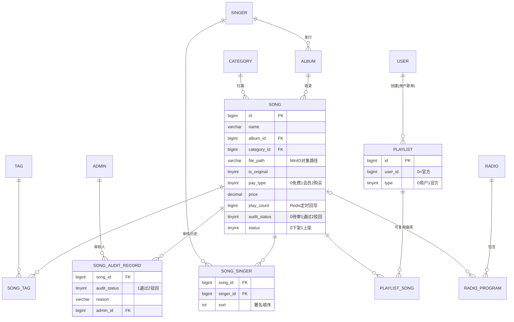
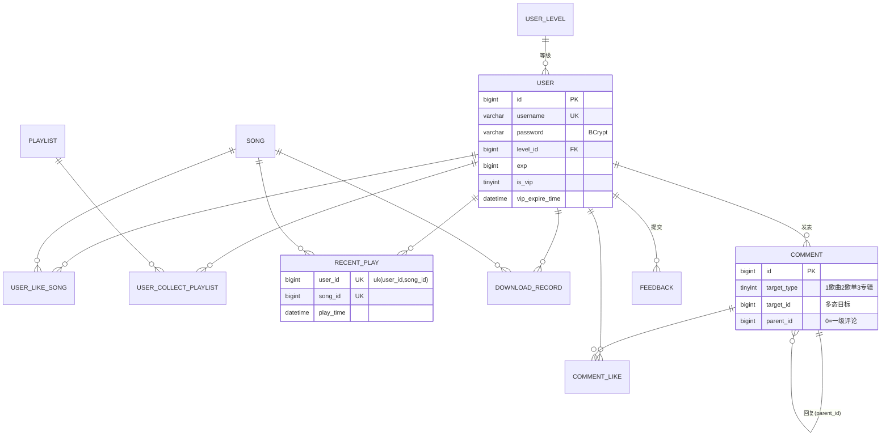
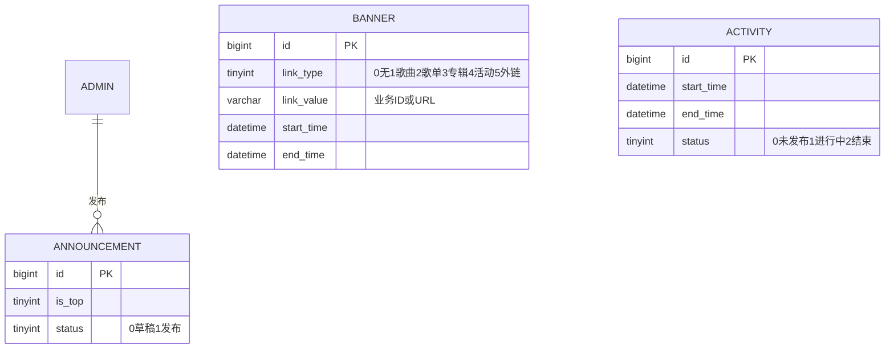
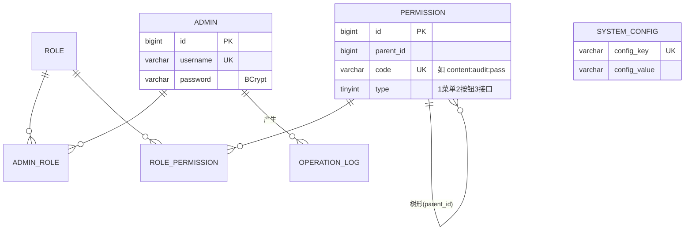
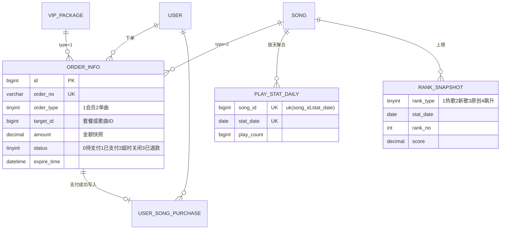

# 音域（yinyu）音乐平台数据库设计文档

> 配套脚本：`sql/init.sql`（建库建表，可在 MySQL 8 直接执行）、`sql/test-data.sql`（演示数据）。

## 1. 总体说明

音域平台包含两个前端：**管理后台**（数据看板、音乐/歌单/专辑/歌手/分类/版权管理、用户与会员管理、运营管理、RBAC 权限、音乐审核等）与**用户门户**（发现页、推荐、私人FM、歌单、排行榜、电台、评论、单曲购买与付费会员、全局播放器等）。数据库按业务域拆分为五个模块，共 **36 张表**：

| 模块 | 表数 | 表 |
| --- | --- | --- |
| 内容模块 | 12 | category、tag、singer、album、song、song_singer、song_tag、song_audit_record、playlist、playlist_song、radio、radio_program |
| 用户模块 | 9 | user、user_level、user_like_song、user_collect_playlist、recent_play、download_record、comment、comment_like、feedback |
| 运营模块 | 3 | banner、announcement、activity |
| 权限与系统模块 | 7 | admin、role、permission、admin_role、role_permission、operation_log、system_config |
| 交易与统计模块 | 5 | vip_package、order_info、user_song_purchase、play_stat_daily、rank_snapshot |

技术栈约定：Spring Boot + MyBatis-Plus + MySQL 8 + Redis + MinIO。音频/图片文件存 MinIO（或本地静态目录），**数据库只存对象相对路径**（如 `music/song/2026/03/xxx.mp3`），访问时由后端拼接外链或签名 URL。

### 1.1 命名与字段规范

- **表名**：全小写 + 下划线，单数名词；关联表用 `主表_从表` 命名（如 `song_singer`）。`order` 是 MySQL 保留字，订单表命名为 `order_info`。
- **主键**：统一 `id BIGINT AUTO_INCREMENT`。代码侧建议配置 MyBatis-Plus 的 `IdType.ASSIGN_ID`（雪花ID）亦可，两者不冲突，本设计以自增为默认。
- **公共字段**（MyBatis-Plus 惯例）：
  - `create_time DATETIME DEFAULT CURRENT_TIMESTAMP`：创建时间（`@TableField(fill = INSERT)`）；
  - `update_time DATETIME DEFAULT CURRENT_TIMESTAMP ON UPDATE CURRENT_TIMESTAMP`：更新时间（`fill = INSERT_UPDATE`）；
  - `deleted TINYINT DEFAULT 0`：逻辑删除标记（`@TableLogic`，0 未删 1 已删）。
- **例外**：纯关系表（`song_singer`、`playlist_song`、`user_like_song` 等）与日志/统计流水表（`operation_log`、`song_audit_record`、`download_record`、`play_stat_daily`、`rank_snapshot`）**不设 `deleted`**，直接物理删除或只增不删——这些表数据无"恢复"语义，逻辑删除只会让唯一索引失效（如取消喜欢后无法再次喜欢）并拖慢查询。
- **状态/枚举**：统一 `TINYINT`，含义写入列 COMMENT，代码侧用枚举类映射。
- **金额**：`DECIMAL(10,2)`，单位元。
- **字符集**：库与表统一 `utf8mb4` / `utf8mb4_general_ci`，支持 emoji（昵称、评论常见）。
- **索引命名**：主键 `PRIMARY`、唯一索引 `uk_xxx`、普通索引 `idx_xxx`。

### 1.2 不使用物理外键

遵循互联网项目惯例，**所有表间关系仅用普通索引/唯一索引表达，不建 FOREIGN KEY**。原因：

1. 物理外键在高并发写入时产生额外锁与级联检查开销；
2. 影响分库分表、归档、灌数等运维操作；
3. 引用完整性由 Service 层事务保证（如删除歌单时同事务删除 `playlist_song`）。

文档中字段说明里的 `-> 表.id` 仅表示**逻辑外键**。

---

## 2. ER 图（按模块）

### 2.1 内容模块



### 2.2 用户模块



### 2.3 运营模块



### 2.4 权限与系统模块（RBAC）



### 2.5 交易与统计模块



---

## 3. 表结构说明

> 公共字段 `create_time` / `update_time` / `deleted` 含义全局一致，下文各表不再重复解释，仅在表格中列出是否存在。索引列格式：`索引名(字段)`。

### 3.1 内容模块

#### category — 音乐分类表

| 字段 | 类型 | 说明 | 索引 |
| --- | --- | --- | --- |
| id | bigint | 主键 | PK |
| name | varchar(50) | 分类名称 | |
| parent_id | bigint | 父分类ID，0=顶级（预留二级分类） | idx_parent_id |
| icon | varchar(255) | 分类图标路径 | |
| sort | int | 排序值 | |
| status | tinyint | 0禁用 1启用 | |
| create_time / update_time / deleted | | 公共字段 | |

#### tag — 标签表

| 字段 | 类型 | 说明 | 索引 |
| --- | --- | --- | --- |
| id | bigint | 主键 | PK |
| name | varchar(50) | 标签名 | uk_name_type(name,type) |
| type | tinyint | 1风格 2语种 3场景 4情绪 | uk_name_type |
| sort | int | 排序值 | |
| status | tinyint | 0禁用 1启用 | |
| create_time / update_time / deleted | | 公共字段 | |

> 增补理由：分类（category）用于单选归类，标签（tag）用于多维打标，是"发现页/为你推荐"按场景、情绪筛选的基础，故在任务要求的 category/tag 上做了双表落地。

#### singer — 歌手表

| 字段 | 类型 | 说明 | 索引 |
| --- | --- | --- | --- |
| id | bigint | 主键 | PK |
| name | varchar(100) | 歌手/乐队名 | idx_name |
| pinyin | varchar(200) | 拼音，用于检索与 A-Z 索引 | |
| type | tinyint | 1男 2女 3乐队/组合 | idx_type_region(type,region) |
| region | varchar(50) | 地区 | idx_type_region |
| avatar / cover | varchar(255) | 头像 / 详情背景图路径 | |
| introduction | text | 简介 | |
| hot | bigint | 热度（定时任务由播放统计汇总） | |
| status | tinyint | 0隐藏 1展示 | |
| create_time / update_time / deleted | | 公共字段 | |

#### album — 专辑表

| 字段 | 类型 | 说明 | 索引 |
| --- | --- | --- | --- |
| id | bigint | 主键 | PK |
| name | varchar(100) | 专辑名 | idx_name |
| singer_id | bigint | 主歌手ID -> singer.id | idx_singer_id |
| cover | varchar(255) | 封面路径 | |
| publish_date | date | 发行日期 | |
| company | varchar(100) | 发行公司 | |
| introduction | text | 简介 | |
| song_count | int | 收录歌曲数（冗余计数） | |
| status | tinyint | 0下架 1上架 | |
| create_time / update_time / deleted | | 公共字段 | |

#### song — 歌曲表（核心）

| 字段 | 类型 | 说明 | 索引 |
| --- | --- | --- | --- |
| id | bigint | 主键 | PK |
| name | varchar(150) | 歌曲名 | idx_name |
| album_id | bigint | 专辑ID，单曲可空 | idx_album_id |
| category_id | bigint | 分类ID | idx_category_id |
| cover | varchar(255) | 封面路径（空则取专辑封面） | |
| file_path | varchar(255) | 音频对象路径（music 桶） | |
| lyric_path | varchar(255) | 歌词 .lrc 对象路径 | |
| duration | int | 时长（秒） | |
| file_size | bigint | 文件大小（字节） | |
| is_original | tinyint | 是否原创（原创榜来源） | |
| pay_type | tinyint | 0免费 1会员免费 2单曲购买 | |
| price | decimal(10,2) | 单曲价格，pay_type=2 有效 | |
| play_count / like_count / collect_count / download_count / comment_count | bigint | 累计计数（冗余，见 §4.4） | |
| audit_status | tinyint | 0待审核 1通过 2驳回 | idx_audit_status |
| status | tinyint | 0下架 1上架 | idx_status_publish(status,publish_time) |
| upload_admin_id | bigint | 录入管理员 | |
| publish_time | datetime | 上架时间（新歌榜来源） | idx_status_publish |
| create_time / update_time / deleted | | 公共字段 | |

#### song_singer — 歌曲-歌手关联表

| 字段 | 类型 | 说明 | 索引 |
| --- | --- | --- | --- |
| id | bigint | 主键 | PK |
| song_id | bigint | 歌曲ID | uk_song_singer(song_id,singer_id) |
| singer_id | bigint | 歌手ID | uk_song_singer；idx_singer_id |
| sort | int | 署名顺序，0=主唱/第一署名 | |
| create_time | datetime | 创建时间 | |

#### song_tag — 歌曲-标签关联表

| 字段 | 类型 | 说明 | 索引 |
| --- | --- | --- | --- |
| id | bigint | 主键 | PK |
| song_id | bigint | 歌曲ID | uk_song_tag(song_id,tag_id) |
| tag_id | bigint | 标签ID | uk_song_tag；idx_tag_id |
| create_time | datetime | 创建时间 | |

#### song_audit_record — 歌曲审核记录表

| 字段 | 类型 | 说明 | 索引 |
| --- | --- | --- | --- |
| id | bigint | 主键 | PK |
| song_id | bigint | 歌曲ID | idx_song_id |
| audit_status | tinyint | 审核结论：1通过 2驳回 | |
| reason | varchar(500) | 审核意见/驳回原因 | |
| admin_id | bigint | 审核人 | idx_admin_id |
| create_time | datetime | 审核时间 | |

#### playlist — 歌单表

| 字段 | 类型 | 说明 | 索引 |
| --- | --- | --- | --- |
| id | bigint | 主键 | PK |
| name | varchar(100) | 歌单名 | |
| user_id | bigint | 创建者，官方歌单为 0 | idx_user_id |
| type | tinyint | 0用户自建 1官方运营 | idx_type_status(type,status) |
| cover | varchar(255) | 封面路径 | |
| introduction | varchar(500) | 简介 | |
| song_count / play_count / collect_count | int/bigint | 冗余计数 | |
| is_public | tinyint | 0私密 1公开 | |
| status | tinyint | 0封禁/隐藏 1正常 | idx_type_status |
| create_time / update_time / deleted | | 公共字段 | |

#### playlist_song — 歌单-歌曲关联表

| 字段 | 类型 | 说明 | 索引 |
| --- | --- | --- | --- |
| id | bigint | 主键 | PK |
| playlist_id | bigint | 歌单ID | uk_playlist_song(playlist_id,song_id) |
| song_id | bigint | 歌曲ID | uk_playlist_song；idx_song_id |
| sort | int | 歌单内顺序 | |
| create_time | datetime | 添加时间 | |

#### radio — 电台表 / radio_program — 电台节目表

| 表 | 字段 | 类型 | 说明 | 索引 |
| --- | --- | --- | --- | --- |
| radio | id / name / cover / introduction / play_count / sort / status + 公共字段 | | 电台栏目本体 | PK |
| radio_program | id | bigint | 主键 | PK |
| radio_program | radio_id | bigint | 所属电台 | idx_radio_id |
| radio_program | title | varchar(150) | 节目标题 | |
| radio_program | song_id | bigint | 可空，复用曲库歌曲 | |
| radio_program | file_path | varchar(255) | 独立音频路径（song_id 为空时用） | |
| radio_program | duration / publish_time / sort / status + 公共字段 | | | |

> 增补理由：门户含"电台"功能，任务清单未列表，按栏目(radio)-节目(radio_program)一对多落地；节目既可挂独立音频，也可通过 song_id 复用曲库，避免重复存储。

### 3.2 用户模块

#### user_level — 用户等级表

| 字段 | 类型 | 说明 | 索引 |
| --- | --- | --- | --- |
| id | bigint | 主键 | PK |
| name | varchar(50) | 等级名称 | |
| level | int | 等级数值 | uk_level |
| min_exp | bigint | 升级所需最小成长值 | |
| icon | varchar(255) | 等级图标 | |
| privilege | varchar(500) | 特权描述 | |
| create_time / update_time / deleted | | 公共字段 | |

#### user — 用户表

| 字段 | 类型 | 说明 | 索引 |
| --- | --- | --- | --- |
| id | bigint | 主键 | PK |
| username | varchar(50) | 登录账号 | uk_username |
| password | varchar(100) | BCrypt 密文 | |
| nickname / avatar / gender / birthday / signature | | 个人资料 | |
| phone | varchar(20) | 手机号 | idx_phone |
| email | varchar(100) | 邮箱 | idx_email |
| level_id | bigint | 当前等级 -> user_level.id | idx_level_id |
| exp | bigint | 成长值 | |
| is_vip | tinyint | 有效会员标记（冗余，以到期时间为准） | |
| vip_expire_time | datetime | 会员到期时间 | |
| status | tinyint | 0封禁 1正常 | |
| last_login_time | datetime | 最后登录时间 | |
| create_time / update_time / deleted | | 公共字段 | |

> 设计说明：门户用户（user）与后台管理员（admin）**分表**——两者认证体系、字段与生命周期完全不同，合表需要类型字段与大量可空列，得不偿失。

#### user_like_song — 用户喜欢歌曲表

| 字段 | 类型 | 说明 | 索引 |
| --- | --- | --- | --- |
| id | bigint | 主键 | PK |
| user_id | bigint | 用户ID | uk_user_song(user_id,song_id) |
| song_id | bigint | 歌曲ID | uk_user_song；idx_song_id |
| create_time | datetime | 喜欢时间 | |

#### user_collect_playlist — 用户收藏歌单表

| 字段 | 类型 | 说明 | 索引 |
| --- | --- | --- | --- |
| id | bigint | 主键 | PK |
| user_id | bigint | 用户ID | uk_user_playlist(user_id,playlist_id) |
| playlist_id | bigint | 歌单ID | uk_user_playlist；idx_playlist_id |
| create_time | datetime | 收藏时间 | |

#### recent_play — 最近播放表

| 字段 | 类型 | 说明 | 索引 |
| --- | --- | --- | --- |
| id | bigint | 主键 | PK |
| user_id | bigint | 用户ID | uk_user_song(user_id,song_id)；idx_user_playtime(user_id,play_time) |
| song_id | bigint | 歌曲ID | uk_user_song |
| play_time | datetime | 最近播放时间（重复播放 UPSERT 更新） | idx_user_playtime |
| play_count | int | 该用户对该曲累计播放次数 | |

> 同一用户同一歌曲仅保留一条（`INSERT ... ON DUPLICATE KEY UPDATE`），列表按 play_time 倒序；每用户保留条数上限由 `system_config.recent_play_limit` 控制，定时清理。

#### download_record — 下载记录表

| 字段 | 类型 | 说明 | 索引 |
| --- | --- | --- | --- |
| id | bigint | 主键 | PK |
| user_id | bigint | 用户ID | idx_user_id(user_id,create_time) |
| song_id | bigint | 歌曲ID | idx_song_id |
| create_time | datetime | 下载时间 | |

#### comment — 评论表

| 字段 | 类型 | 说明 | 索引 |
| --- | --- | --- | --- |
| id | bigint | 主键 | PK |
| user_id | bigint | 评论人 | idx_user_id |
| target_type | tinyint | 1歌曲 2歌单 3专辑（多态目标） | idx_target(target_type,target_id,create_time) |
| target_id | bigint | 目标ID | idx_target |
| content | varchar(1000) | 内容 | |
| parent_id | bigint | 根评论ID，0=一级评论（两级结构） | idx_parent_id |
| reply_user_id | bigint | 被回复用户 | |
| like_count | int | 点赞数（冗余） | |
| status | tinyint | 0屏蔽 1正常 | |
| create_time / update_time / deleted | | 公共字段 | |

> 采用**多态评论**（target_type + target_id），一张表覆盖歌曲/歌单/专辑评论，避免三张同构表；回复采用两级结构（所有回复挂到根评论下），与主流音乐 App 交互一致，查询简单。

#### comment_like — 评论点赞表

| 字段 | 类型 | 说明 | 索引 |
| --- | --- | --- | --- |
| id | bigint | 主键 | PK |
| user_id | bigint | 用户ID | uk_user_comment(user_id,comment_id) |
| comment_id | bigint | 评论ID | uk_user_comment；idx_comment_id |
| create_time | datetime | 点赞时间 | |

#### feedback — 用户反馈表

| 字段 | 类型 | 说明 | 索引 |
| --- | --- | --- | --- |
| id | bigint | 主键 | PK |
| user_id | bigint | 反馈人 | idx_user_id |
| type | tinyint | 1功能异常 2建议 3版权投诉 4其他 | |
| content | varchar(2000) | 反馈内容 | |
| images | varchar(1000) | 截图路径，逗号分隔 | |
| contact | varchar(100) | 联系方式 | |
| status | tinyint | 0待处理 1已处理 | idx_status |
| reply / handle_admin_id / handle_time | | 处理信息 | |
| create_time / update_time / deleted | | 公共字段 | |

### 3.3 运营模块

#### banner — 轮播图表

| 字段 | 类型 | 说明 | 索引 |
| --- | --- | --- | --- |
| id | bigint | 主键 | PK |
| title | varchar(100) | 标题 | |
| image | varchar(255) | 图片路径 | |
| link_type | tinyint | 0无 1歌曲 2歌单 3专辑 4活动 5外链 | |
| link_value | varchar(255) | 业务ID或URL | |
| sort | int | 排序 | idx_status_sort(status,sort) |
| start_time / end_time | datetime | 生效时间窗，空=不限 | |
| status | tinyint | 0下线 1上线 | idx_status_sort |
| create_time / update_time / deleted | | 公共字段 | |

#### announcement — 公告表

| 字段 | 类型 | 说明 | 索引 |
| --- | --- | --- | --- |
| id | bigint | 主键 | PK |
| title | varchar(150) | 标题 | |
| content | text | 富文本内容 | |
| is_top | tinyint | 是否置顶 | |
| admin_id | bigint | 发布人 | |
| publish_time | datetime | 发布时间 | idx_status_publish(status,publish_time) |
| status | tinyint | 0草稿/下线 1发布 | idx_status_publish |
| create_time / update_time / deleted | | 公共字段 | |

#### activity — 活动表

| 字段 | 类型 | 说明 | 索引 |
| --- | --- | --- | --- |
| id | bigint | 主键 | PK |
| title / cover / content | | 活动信息（content 富文本） | |
| start_time / end_time | datetime | 活动起止 | idx_status_time(status,start_time,end_time) |
| sort | int | 排序 | |
| status | tinyint | 0未发布 1进行中 2已结束（定时任务流转） | idx_status_time |
| create_time / update_time / deleted | | 公共字段 | |

### 3.4 权限与系统模块

#### admin — 管理员表

| 字段 | 类型 | 说明 | 索引 |
| --- | --- | --- | --- |
| id | bigint | 主键 | PK |
| username | varchar(50) | 登录账号 | uk_username |
| password | varchar(100) | BCrypt 密文 | |
| nickname / avatar / phone / email | | 资料 | |
| status | tinyint | 0禁用 1启用 | |
| last_login_time | datetime | 最后登录 | |
| create_time / update_time / deleted | | 公共字段 | |

#### role — 角色表

| 字段 | 类型 | 说明 | 索引 |
| --- | --- | --- | --- |
| id | bigint | 主键 | PK |
| name | varchar(50) | 角色名 | |
| code | varchar(50) | 角色编码（SUPER_ADMIN 等） | uk_code |
| description | varchar(255) | 描述 | |
| status | tinyint | 0禁用 1启用 | |
| create_time / update_time / deleted | | 公共字段 | |

#### permission — 权限表

| 字段 | 类型 | 说明 | 索引 |
| --- | --- | --- | --- |
| id | bigint | 主键 | PK |
| parent_id | bigint | 父权限，0=顶级（树形） | idx_parent_id |
| name | varchar(50) | 权限名 | |
| code | varchar(100) | 权限编码（如 content:audit:pass） | uk_code |
| type | tinyint | 1菜单 2按钮 3接口 | |
| path / icon / sort | | 前端路由、图标、排序 | |
| status | tinyint | 0禁用 1启用 | |
| create_time / update_time / deleted | | 公共字段 | |

#### admin_role / role_permission — RBAC 关联表

| 表 | 字段 | 索引 |
| --- | --- | --- |
| admin_role | id、admin_id、role_id、create_time | uk_admin_role(admin_id,role_id)；idx_role_id |
| role_permission | id、role_id、permission_id、create_time | uk_role_permission(role_id,permission_id)；idx_permission_id |

标准 RBAC：admin —(admin_role)— role —(role_permission)— permission，登录后聚合权限编码集合下发前端控制菜单/按钮，后端注解校验接口权限。

#### operation_log — 操作日志表

| 字段 | 类型 | 说明 | 索引 |
| --- | --- | --- | --- |
| id | bigint | 主键 | PK |
| admin_id | bigint | 操作人 | idx_admin_id |
| module / operation | varchar | 模块与操作描述 | |
| method | varchar(255) | 接口路径 | |
| params | text | 请求参数 JSON | |
| ip | varchar(50) | 操作IP | |
| status | tinyint | 0失败 1成功 | |
| error_msg | varchar(1000) | 异常信息 | |
| cost_time | bigint | 耗时（毫秒） | |
| create_time | datetime | 操作时间 | idx_create_time |

日志表只增不改不删，无 update_time/deleted；数据量大后可按月归档。

#### system_config — 系统配置表

| 字段 | 类型 | 说明 | 索引 |
| --- | --- | --- | --- |
| id | bigint | 主键 | PK |
| config_key | varchar(100) | 配置键 | uk_config_key |
| config_value | varchar(2000) | 配置值 | |
| description | varchar(255) | 说明 | |
| create_time / update_time / deleted | | 公共字段 | |

键值对承载"系统设置"页：站点信息、订单超时分钟数、最近播放上限等，应用启动加载并缓存，修改后刷新缓存。

### 3.5 交易与统计模块

#### vip_package — 会员套餐表

| 字段 | 类型 | 说明 | 索引 |
| --- | --- | --- | --- |
| id | bigint | 主键 | PK |
| name | varchar(50) | 套餐名（月/季/年卡） | |
| days | int | 会员时长（天） | |
| price / original_price | decimal(10,2) | 售价 / 划线价 | |
| sort / status | | 排序、上下架 | |
| create_time / update_time / deleted | | 公共字段 | |

#### order_info — 订单表

| 字段 | 类型 | 说明 | 索引 |
| --- | --- | --- | --- |
| id | bigint | 主键 | PK |
| order_no | varchar(64) | 业务订单号 | uk_order_no |
| user_id | bigint | 下单人 | idx_user_id(user_id,create_time) |
| order_type | tinyint | 1会员套餐 2单曲购买 | |
| target_id | bigint | 商品ID（套餐或歌曲） | |
| target_name | varchar(150) | 商品名快照 | |
| amount | decimal(10,2) | 金额快照 | |
| pay_channel | tinyint | 1支付宝 2微信 3模拟支付 | |
| status | tinyint | 0待支付 1已支付 2超时关闭 3已退款 | idx_status_expire(status,expire_time) |
| expire_time | datetime | 支付截止时间 | idx_status_expire |
| pay_time / close_time / transaction_id / remark | | 支付与关闭信息 | |
| create_time / update_time / deleted | | 公共字段 | |

#### user_song_purchase — 用户已购单曲表

| 字段 | 类型 | 说明 | 索引 |
| --- | --- | --- | --- |
| id | bigint | 主键 | PK |
| user_id | bigint | 用户ID | uk_user_song(user_id,song_id) |
| song_id | bigint | 歌曲ID | uk_user_song；idx_song_id |
| order_id | bigint | 来源订单 | |
| create_time | datetime | 购买时间 | |

> 增补理由：付费歌曲的播放/下载鉴权是高频操作，直接命中本表唯一索引，避免每次扫 order_info 判断"是否存在已支付的该曲订单"。

#### play_stat_daily — 歌曲每日统计表

| 字段 | 类型 | 说明 | 索引 |
| --- | --- | --- | --- |
| id | bigint | 主键 | PK |
| song_id | bigint | 歌曲ID | uk_song_date(song_id,stat_date) |
| stat_date | date | 统计日期 | uk_song_date；idx_stat_date |
| play_count | bigint | 当日播放量 | |
| like_count / collect_count / download_count | bigint | 当日新增喜欢/收藏/下载 | |
| create_time / update_time | | 无 deleted | |

#### rank_snapshot — 榜单快照表

| 字段 | 类型 | 说明 | 索引 |
| --- | --- | --- | --- |
| id | bigint | 主键 | PK |
| rank_type | tinyint | 1热歌 2新歌 3原创 4飙升 | uk_type_date_rank(rank_type,stat_date,rank_no) |
| stat_date | date | 榜单日期 | uk_type_date_rank；idx_type_date_song |
| song_id | bigint | 歌曲ID | idx_type_date_song |
| rank_no | int | 名次 | uk_type_date_rank |
| score | decimal(16,2) | 榜单得分 | |
| create_time | datetime | 生成时间 | |

---

## 4. 关键设计决策

### 4.1 歌曲 ↔ 歌手：多对多（合唱）

一首歌可由多位歌手合唱，一位歌手有多首歌，故通过 `song_singer` 关联表建模，`(song_id, singer_id)` 唯一索引防重，`sort` 字段保留署名顺序（0 为主唱），前端展示 "歌手A / 歌手B"。**song 表不冗余 singer_id**，避免合唱场景下语义歧义；歌手页查询走 `idx_singer_id`。

### 4.2 歌曲 ↔ 专辑：多对一

一首歌最多属于一张专辑，直接在 `song.album_id` 落一对多外键（逻辑），单曲/未收录歌曲置空。专辑的 `singer_id` 指主歌手，专辑内合唱歌曲的完整署名仍以 `song_singer` 为准。`album.song_count` 为冗余计数，随歌曲增删同事务维护。

### 4.3 歌单 ↔ 歌曲：多对多

`playlist_song` 关联表 + `(playlist_id, song_id)` 唯一索引 + `sort` 排序字段，支持拖拽调序。官方运营歌单与用户自建歌单**共用一张表**，用 `type` 区分、官方歌单 `user_id=0`——两者字段完全同构，分表只会让门户"歌单详情/搜索"逻辑写两遍。"我喜欢的音乐"独立成 `user_like_song`（而非隐藏歌单），因为它没有封面/简介/排序等歌单属性，且是红心状态高频判断点，独立表更轻。

### 4.4 审核状态机

```
        提交/录入            审核通过
 [0 待审核] ────────────────→ [1 通过] ──→ 可上架(status=1)
      ↑   ╲ 审核驳回
      │    ╲──────→ [2 驳回]
      └────────────────┘ 修改后重新提交（audit_status 重置为 0）
```

- **当前状态**放在 `song.audit_status` 上（列表筛选走 `idx_audit_status`，"待审核/通过/驳回"三个 tab 直接按此过滤）；
- **审核历史**每次动作追加一条 `song_audit_record`（结论、意见、审核人、时间），满足追溯与审核工作量统计；
- 约束在应用层保证：仅 `audit_status=1` 的歌曲允许 `status=1` 上架并对门户可见；驳回后重新编辑提交则重置为待审核。

### 4.5 播放量：Redis 计数 + 定时落库 + 按天聚合

播放是最高频写操作，不能每次播放都 UPDATE song 表：

1. 播放上报只做 `Redis HINCRBY`（如 `play:count:{yyyyMMdd}` hash，field 为 song_id；喜欢/收藏/下载计数同理）；
2. 定时任务（如每 10 分钟）把增量 UPSERT 进 `play_stat_daily`（`uk_song_date` 保证按 歌曲+天 幂等聚合），同时把增量累加到 `song.play_count` 等冗余总量字段；
3. `play_stat_daily` 即后台"数据统计"模块（趋势图、Top 榜）与排行榜计算的数据源；跨天数据只增不改，便于归档。

`song` 上的累计计数属于**可重算冗余**：任何不一致都可由明细/日表重算修复，因此允许最终一致。

### 4.6 排行榜来源

四个榜单均由定时任务（如每日凌晨）基于既有数据计算并写入 `rank_snapshot`，门户端**只读快照**，接口零聚合计算：

| 榜单 | 计算来源 |
| --- | --- |
| 热歌榜 | 近 N 天（如 7 天）`play_stat_daily` 播放/喜欢/收藏加权求和 |
| 新歌榜 | `song.publish_time` 在近 30 天内的歌曲，按近若干天热度排序 |
| 原创榜 | `song.is_original=1` 的歌曲，按热歌榜同款算法排序 |
| 飙升榜 | 相邻两个统计窗口的播放量环比增速（增量/增幅加权） |

快照按 `(rank_type, stat_date)` 留存历史，天然支持"上升/下降 X 名"的名次对比展示。

### 4.7 订单状态机（会员 + 单曲统一订单）

会员购买与单曲购买共用 `order_info`（`order_type` 区分，`target_id` 多态指向套餐或歌曲），商品名与金额做**下单快照**，防止后续改价改名影响历史订单。

```
 [0 待支付] ──支付回调──→ [1 已支付] ──售后──→ [3 已退款]
      │
      └──超过 expire_time（定时关单/延迟消息）──→ [2 超时关闭]
```

- 下单时写入 `expire_time`（时长取 `system_config.order_expire_minutes`），关单任务扫 `idx_status_expire(status=0, expire_time<now)`，避免全表扫描；
- 支付成功在同一事务内：更新订单状态 → 会员单则顺延 `user.vip_expire_time` 并置 `is_vip=1`，单曲单则写入 `user_song_purchase`；
- 状态流转只允许上图箭头方向，更新一律带原状态做乐观条件（`WHERE status=0`），防止回调与关单并发互踩。

### 4.8 其他增删说明

- **未建 user_follow_singer（关注歌手）、签到表**：当前两端需求清单未包含，属易扩展的独立关系表，留待迭代；
- **comment_like、song_tag、rank_snapshot、user_song_purchase、radio/radio_program** 为在任务最小清单上的增补，理由已在各表处说明；
- **版权管理**未单独建表：当前以 `song.pay_type/is_original + feedback.type=版权投诉 + song_audit_record` 组合支撑，若后续需要版权方、授权期限管理，可增补 `copyright` 表挂在 song 上。
